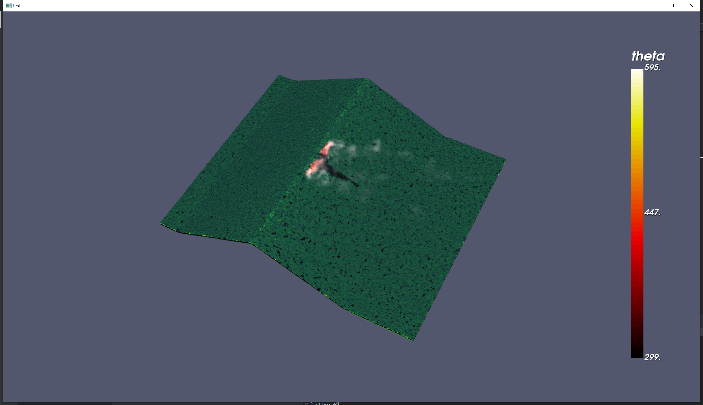
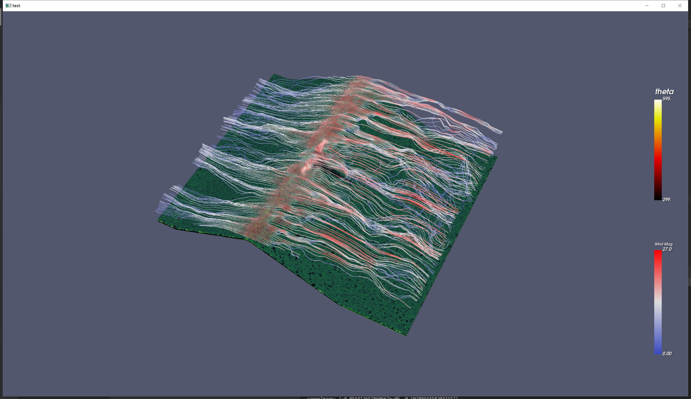

# wildfire-simulation
Project for the course Scientific Visualization at ETH in spring 2023.

## Disclaimer

If you are having trouble with dependencies, try using the provided `conda.yml` file.

## TODO List
- [X] Load an `.vts` file.
- [X] Resample curvilinear data to image data (for fire and watervapor) as done in Paraview.
- [X] Extract curvilinear subset (for soil and grass) as done in Paraview.
- [X] Define colormap based on Paraview colormap file.
- [X] Volume rendering on: fire, water vapor, grass.
- [X] Surface rendering on: soil.
- [X] Set camera intrinsics and extrinsics.
- [X] Build vtk code pipeline.
- [ ] Tune colormaps.
- [X] Compositie wind velocity field.
- [ ] Compute wind gradient field and vorticity.
- [X] Visualize velocity streamline. 
- [ ] Visualize vorticity. 
- [ ] Generate animations on 6 datasets.
- [ ] Convert `theta` from cell to point values.
- [ ] Analyzing factors contribute to VLS behavior.
- [ ] Final presentation slides.
- [ ] Final report.

## Log
### 4.30 General Code Pipeline

    

### 5.2 Composite Velocity Field + Visualize Streamlines

    

