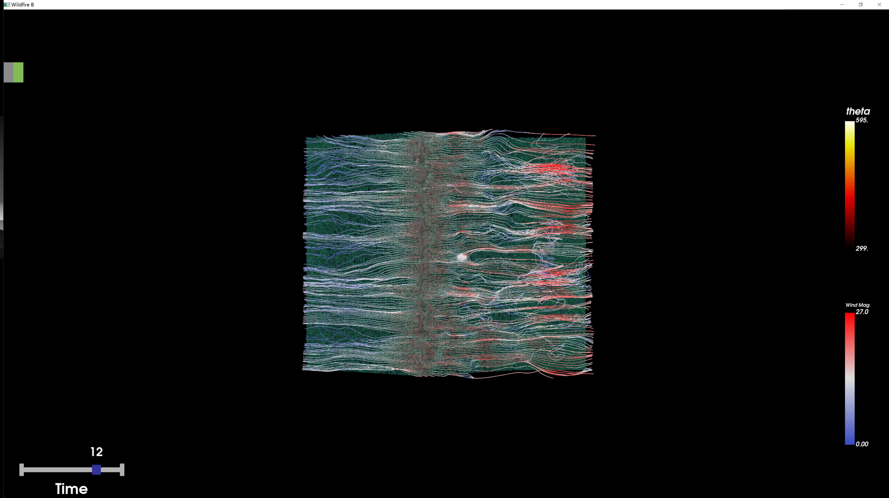

# wildfire-simulation
Project for the course Scientific Visualization at ETH in spring 2023.

## Disclaimer

If you are having trouble with dependencies, try using the provided `conda.yml` file.

## TODO List (**5 points missing**)
- [X] Load an `.vts` file.
- [X] Resample curvilinear data to image data (for fire and watervapor) as done in Paraview.
- [X] Extract curvilinear subset (for soil and grass) as done in Paraview.
- [X] (**5 points**) Define colormap based on Paraview colormap file (transfer function editing).
- [X] (**5 points**) Volume rendering on: fire, water vapor, grass.
- [X] Surface rendering on: soil.
- [X] Set camera intrinsics and extrinsics.
- [X] Build vtk code pipeline.
- [ ] Tune colormaps.
- [X] Compositie wind velocity field.
- [X] Compute wind gradient field and vorticity.
- [X] (**5 points**) Visualize velocity streamline. 
- [X] (**5/3 points**) Compute & visualize vorticity. 
- [ ] (**5/3 points**) Compute & visualize lambda2.
- [ ] (**5/3 points**) Compute & visualize divergence.
- [X] Animation codes.
- [ ] (**5 points**) Generate animations on 6 datasets.
- [ ] Convert `theta` from cell to point values.
- [X] GUI code pipeline.
- [ ] Data preprocessing (in vtk).
- [ ] GUI using preprocessed files.
- [ ] GUI refinements.
- [ ] Analyzing factors contribute to VLS behavior.
- [ ] Final presentation slides.
- [ ] (*10 points*) Final report.

## Log
### 4.30 General Code Pipeline

    

### 5.2 Composite Velocity Field + Visualize Streamlines

    

### 5.6 GUI Code Pipeline

    

### 5.7 Visualized Vorticity

    

### 5.8 Add Naive Animation Codes & Fix Blank Window Bug
- Use `getAnimation.py` to get full animations
- Fix blank window bug